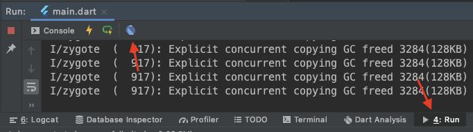
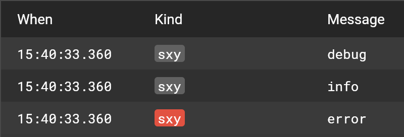

# 其他

### 日志打印

点击如图箭头处，将在浏览器上打开 Dart DevTool 网页。



通过一下代码来执行日志显示

```dart
import 'dart:developer';
import 'package:flutter/foundation.dart';

class Log {
  /// 只会在 debug 模式下输出到 Flutter Logging View
  static d(String tag, String message) {
    if (kDebugMode) {
      log(message, name: tag);
    }
  }

  /// 在 release 模式下输出到设备端的日志区
  /// 在非 release 模式下输出到 Flutter Logging View
  static i(String tag, String message) {
    if (kReleaseMode) {
      print('[Info][$tag] $message');
    } else {
      log(message, name: tag);
    }
  }

  /// 在 release 模式下输出到设备端的日志区
  /// 在非 release 模式下输出到 Flutter Logging View，并将 level 升至 1000，显示红色
  static e(String tag, String message) {
    if (kReleaseMode) {
      print('[Error][$tag] $message');
    } else {
      log(message, name: tag, level: 1000);
    }
  }
}
```

最终效果如图：



### Bugly

使用 Channel 方案访问平台接口实现。

### 埋点

使用 Channel 方案访问平台接口实现。

### 断点调试

在 Android Studio 中断点调试的方式和平时进行原生开发的方式是一样的。