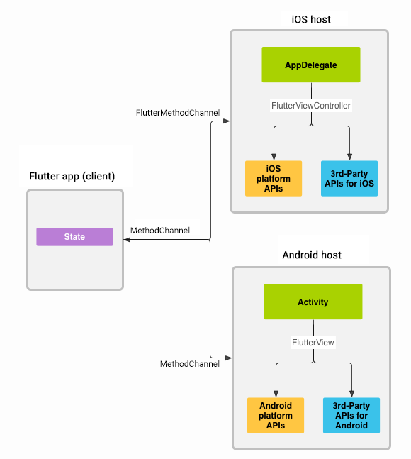

# 访问平台接口

### 概述

当通过 Channel 发送数据时，数据将自动使用类似 JSON 值的方式进行高效序列化和反序列化。

[不同平台的类型映射关系](https://www.notion.so/3e3d82d86c4a4aa48167e0767e9dcd6c)



### Flutter 端实现

通道的客户端和宿主端通过传递给通道构造函数的通道名称进行连接。一个应用中所使用的所有通道名称必须是唯一的，使用唯一的域前缀为通道名称添加前缀，比如：com.flutter.demo/info。

```dart
class _MainState extends State<_Main> {
  static const platform = const MethodChannel('com.flutter.demo/info');

  String _platformInfo = 'Unknown';

  @override
  Widget build(BuildContext context) {
    return GestureDetector(
      child: Text('$_platformInfo'),
      onTap: () {
        _getPlatformInfo();
      },
    );
  }

  Future<void> _getPlatformInfo() async {
    String platformInfo;
    try {
      platformInfo = await platform.invokeMethod('getPlatformInfo');
    } on Exception catch (e) {
      platformInfo = 'Failed to get platform info: $e';
    }

    setState(() {
      _platformInfo = platformInfo;
    });
  }
}
```

### Android 端实现

```kotlin
class MainActivity : FlutterActivity() {

    override fun configureFlutterEngine(flutterEngine: FlutterEngine) {
        MethodChannel(flutterEngine.dartExecutor.binaryMessenger, CHANNEL)
                .setMethodCallHandler { call, result ->
                    if (call.method == "getPlatformInfo") {
                        val platformInfo = "android"
                        if (platformInfo.isNotEmpty()) {
                            result.success(platformInfo)
                        } else {
                            result.error("error", "No info", null)
                        }
                    } else {
                        result.notImplemented()
                    }
                }
    }

    companion object {
        private const val CHANNEL = "com.flutter.demo/info"
    }
}
```

### iOS 端实现

详见：[https://flutter.cn/docs/development/platform-integration/platform-channels?tab=ios-channel-swift-tab#step-4a-add-an-ios-platform-specific-implementation](https://flutter.cn/docs/development/platform-integration/platform-channels?tab=ios-channel-swift-tab#step-4a-add-an-ios-platform-specific-implementation)